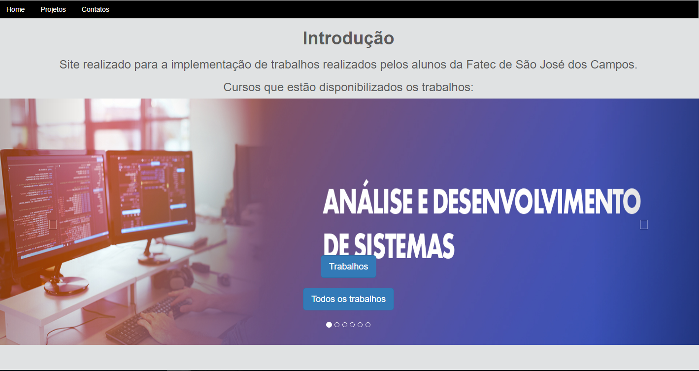

<h1 align="center">API 1º SEMESTRE - 2021-2</h1>

### Parceiro Acadêmico

A [Faculdade de Tecnologia de São José dos Campos — Prof. Jessen Vidal](https://fatecsjc-prd.azurewebsites.net/) que pertence ao Centro Paula Souza, oferece cursos de graduação para formar tecnólogos.  
Para acompanhar o crescimento da chamada indústria 4.0, a instituição propôs adotar uma estratégia de Aprendizado por Projeto Integrador (chamado API), e nesse segundo semestre de 2021, iniciou esse projeto e se disponibilizou como empresa parceira.

### Visão do Projeto

O projeto desenvolvido pelo grupo, denominado Fatech, tem o objetivo de facilitar o acesso de usuários a projetos antecessores do API (Aprendizagem por Projetos Integrados).

Foi desenvolvida uma solução em Python que automatiza a clonagem de repositórios GitHub de projetos anteriores da FATEC SJC. Através da raspagem das URLs das APIs da FATEC, os repositórios são clonados e visando a comodidade do cliente, a equipe buscou organizar por curso, semestre, ano e turma. Além disso, um website foi criado usando HTML e CSS para exibir os projetos indexados, facilitando o acesso e a visualização dos mesmos.

### Link do Github
<a href="https://github.com/Grupo-4-Fatech/API-1Semestre" target="_blank">&nbsp;&nbsp;&nbsp;Repositório dedicado ao 1°Semestre - FATECH</a>

#### Tecnologias adotadas na solução

As tecnologias adotadas para a solução foram as seguintes:  

- **Back-end:** Python, JavaScript;
- **Front-end:** HTML, CSS;
- **Ferramentas:** Visual Studio Code, Canva, Git, Github, PowerPoint, Microsoft Teams e Discord. ㅤ

#### Hard Skills

1. **Programação em Python:** A automação da clonagem de repositórios e a raspagem de dados foram realizadas utilizando a linguagem Python. Isso permitiu desenvolver habilidades avançadas em programação, manipulação de strings, e bibliotecas específicas.

2. **Desenvolvimento Web (HTML/CSS):** A criação do website envolveu a construção de páginas web com HTML para estrutura e CSS para estilização. Isso proporcionou experiência no desenvolvimento de interfaces de usuário atraentes e funcionais.

3. **Controle de Versão (Git):** A clonagem de repositórios do GitHub e o upload dos projetos demandaram o uso eficaz do Git para controle de versão. Isso incluiu a criação de commits, resolução de conflitos e fusão de código.

4. **Organização de Dados:** A organização de projetos por curso, semestre, ano e turma demonstrou habilidades em estruturar dados de maneira hierárquica, permitindo acesso fácil e eficiente aos recursos.

#### Soft Skills  

1. **Comunicação Efetiva:** Durante o processo de automatização da clonagem e raspagem, foi essencial manter uma comunicação clara com a equipe para entender os requisitos e expectativas, além de reportar o progresso e possíveis desafios encontrados.

2. **Colaboração e Trabalho em Equipe:** A coordenação com os membros da equipe de desenvolvimento, design e conteúdo foi fundamental para garantir que o website refletisse as necessidades da FATEC SJC e que os projetos fossem organizados de forma adequada.

3. **Resolução de Problemas:** Enfrentar obstáculos ao automatizar a clonagem de repositórios e a raspagem de dados exigiu habilidades sólidas de resolução de problemas. Identificar erros, depurar código e otimizar processos foram etapas cruciais.

4. **Gerenciamento do Tempo:** Lidar com várias tarefas, desde a criação do website até a geração de código incorporável, demandou uma gestão eficiente do tempo. Definir prioridades e cumprir prazos foi vital para o sucesso do projeto.