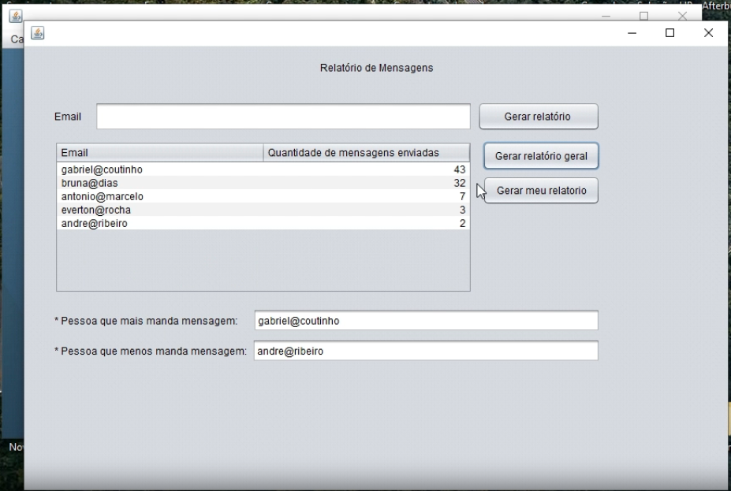

<h1 align="center">API 2º SEMESTRE - 2022-1</h1>

### Parceiro Acadêmico

A [Pro4Tech](https://www.pro4tech.com.br/) é uma empresa especializada em Digital Transformation, e utiliza tecnologias como inteligência artificial, análise de dados, IoT e nuvem, aliadas à para aumentar a eficiência operacional, melhorar a experiência do cliente e impulsionar o crescimento. A empresa propôs de desenvolver uma aplicação Desktop que organizasse a comunicação com os clientes.

### Visão do Projeto

Desenvolvimento de uma aplicação desktop para solucionar problemas causados por mensagens de canais diferentes.

Foi desenvolvido um sistema que oferece a unificação das mensagens em uma única base de dados. Para apresentação das informações foi criado um menu de controle, neste menu existem as opções de cadastrar, alterar, deletar e visualizar as informações referentes as mensagens, usuários e grupos.

<a href="https://drive.google.com/file/d/16iggC4njt9wMS8JhU1LAKnqJ4V-naP-6/view?usp=sharing" target="_blank">
    
     
    - Link do vídeo de apresentação da aplicação.
</a>

### • Link do Github

<a href="https://github.com/Grupo-4-Fatech/API-2Semestre" target="_blank">&nbsp;&nbsp;&nbsp;Repositório dedicado ao 2°Semestre - FATECH</a>

## Tecnologias adotadas na solução

As tecnologias adotadas para a solução foram as seguintes:

<table>
    <tr>
        <th>Tecnologia</th>
        <th>Utilização</th>
    </tr>
    <tr>
        <td style="text-align:center">
        

              
            <strong>Java</strong>
        

        </td>
        <td style="text-align:center">
            Utilizado para criação das interfaces quanto da conexão com o banco de dados.
        </td>
    </tr>
    <tr>
        <td style="text-align:center">
        

            <strong> MySQL
        

        </td>
        <td style="text-align:center">
            Utilizado como banco de dados do projeto.
        </td>
    </tr>
    <tr>
        <td style="text-align:center">
        

              
            <strong>NetBeans</strong>
        

        </td>
        <td style="text-align:center">
            Utilizado como ferramenta de apoio para o desenvolvimento do código.
        </td>
    </tr>
    <tr>
        <td style="text-align:center">
            

                  
                <strong>GIT | GitHub </strong>
            

        </td>
        <td style="text-align:center">
            Utilizado para versionamento e armazenamento do código.
        </td>
    </tr>
    <tr>
        <td style="text-align:center">
        

              
            <strong>Discord</strong>
        

        </td>
        <td style="text-align:center">
            Utilizado para comunicação do time.
        </td>
    </tr>
</table>

## Contribuições Pessoais

Contribuí para o projeto desenvolvendo o Diagrama Entidade Relacionamento, a modelagem do banco de dados(SQL) e a criação dos relatórios e partes do CRUD de usuários e mensagens utilizando a linguagem Java. Além disso, criei documentação em HTML e Markdown no README do GitHub.

### Hard Skills

- **Programação em JAVA:** Sei fazer com ajuda.

- **Banco de Dados (SQL):** Sei fazer com autonomia.

- **Controle de Versão (Git):** Sei fazer com autonomia.

### Soft Skills

- **Empatia:** Durante o projeto, exercendo a função de Scrum Master pela primeira vez, precisei solidificar a minha empatia com os outros integrantes, compreendendo a situação e dificuldade de cada um, tanto técnica quanto emocional. Consequentemente, tive que lidar com situações que demandavam análise individual para que a equipe não perdesse a harmonia e efetuasse as entregas dentro do prazo estipulado.

- **Harmonia:** Paralelamente à empatia, precisei estalabecer a harmonia entre os desenvolvedores, buscando o consenso entre todos. É muito importante que a equipe caminhe em concordância durante toda a trajetoria do projeto. Procurei levar todos rumo à reconciliação para obter um ponto em comum e prosseguir com a implementação do projeto.