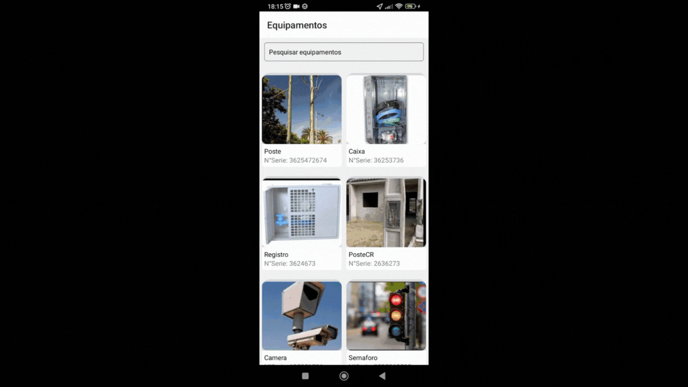

<h1 align="center">API 5º SEMESTRE - 2023-2</h1>

### Parceiro Acadêmico

A [Imagem](https://www.img.com.br/) é uma empresa brasileira de tecnologia líder em Sistemas de Informações Geográficas, distribuidora oficial no Brasil da plataforma ArcGIS, da norte-americana Esri. A empresa propôs de desenvolver uma aplicação mobile de gerenciamento de equipamentos e usuários, com hierarquia de privilégios e um sistema de geolocalização.

### Visão do Projeto

Desenvolver uma aplicação móvel onde seja possível consultar, atualizar, desativar e cadastrar dados dos equipamentos (ativos) da companhia, via aplicativo móvel, possibilitando manter o cadastro dos ativos atualizados.

### • Link do Github

<a href="https://github.com/4-Fatech/API5Semestre" target="_blank">&nbsp;&nbsp;&nbsp;Repositório dedicado ao 5°Semestre - FATECH</a>

## Tecnologias adotadas na solução

As tecnologias adotadas para a solução foram as seguintes:

<table>
    <tr>
        <th>Tecnologia</th>
        <th>Utilização</th>
    </tr>
    <tr>
        <td style="text-align:center">
        

              
            <strong>TypeScript</strong>
        

        </td>
        <td style="text-align:center">
            Utilizado para desenvolvimento do backend e conexão com o banco de dados.
        </td>
    </tr>
    <tr>
        <td style="text-align:center">
        

              
            <strong>React</strong>
        

        </td>
        <td style="text-align:center">
            Framework utilizado para desenvolvimento e estilização de interfaces simples e interativas.
        </td>
    </tr>
    <tr>
        <td style="text-align:center">
        

            <strong> MongoDB
        

        </td>
        <td style="text-align:center">
            Utilizado como banco de dados do projeto.
        </td>
    </tr>
    <tr>
        <td style="text-align:center">
        

            
            <strong> Visual Studio Code</strong>
        

        </td>
        <td style="text-align:center">
            Utilizado como ferramenta de apoio para o desenvolvimento do código.
        </td>
    </tr>
    <tr>
        <td style="text-align:center">
            

                  
                <strong>GIT | GitHub </strong>
            

        </td>
        <td style="text-align:center">
            Utilizado para versionamento e armazenamento do código.
        </td>
    </tr>
    <tr>
        <td style="text-align:center">
        

              
            <strong>Discord</strong>
        

        </td>
        <td style="text-align:center">
            Utilizado para comunicação do time.
        </td>
    </tr>
</table>

## Contribuições Pessoais

Para a construção do projeto, minha contribuição foi focada no frontend, utilizando o React Native, mas também colaborei no backend realizando algumas manutenções do código. Também realizei a concepção e desenvolvimento do design, a busca de API's para utilização, a configuração dos mapas e algumas regras de validação. Além disso, criei documentação em HTML e Markdown no README do GitHub.

### Hard Skills

- **Programação em TypeScript:** Sei fazer com autonomia.

- **Desenvolvimento Mobile em React Native:** Sei fazer com autonomia.

- **Banco de Dados (MongoDB):** Sei fazer com ajuda.

- **Controle de Versão (Git):** Sei fazer com autonomia.

### Soft Skills

- **Adaptabilidade:** O tema do projeto era totalmente desconhecido pela equipe. Portanto, fomos descobrindo os detalhes de cada funcionalidade um dia de cada vez, para que não ficássemos ansiosos quanto à aplicabilidade real do nosso software.
  
- **Autodidatismo:** Buscando conhecimento essa nova área de processamento de dados geoespaciais, além de conhecer novas API's, como a Google Maps API, para a manipulação dos mesmos.